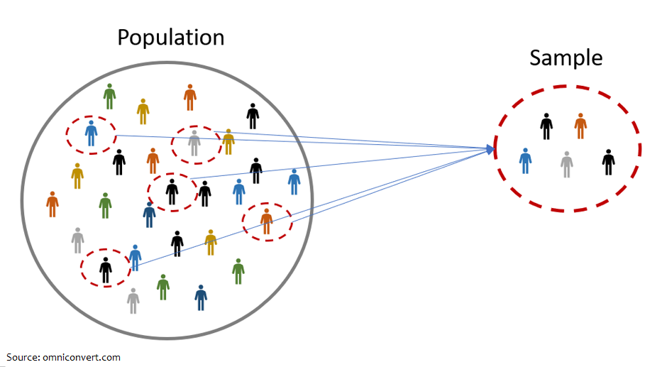
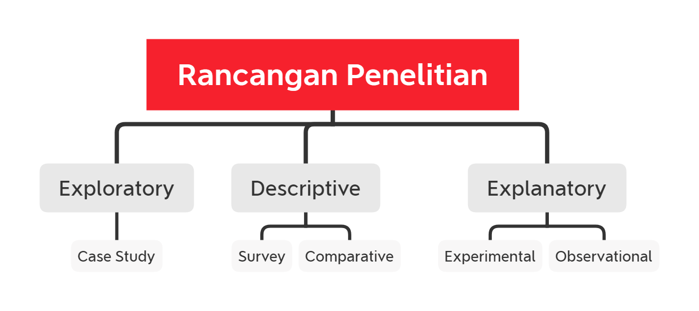
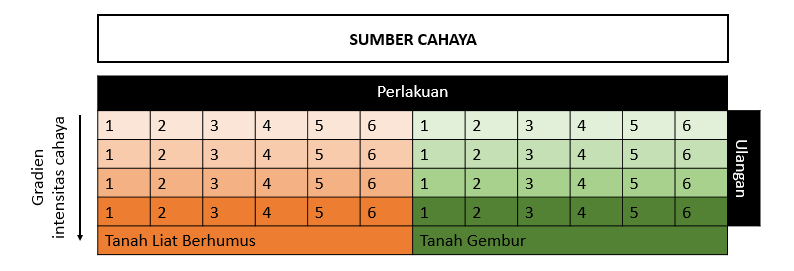
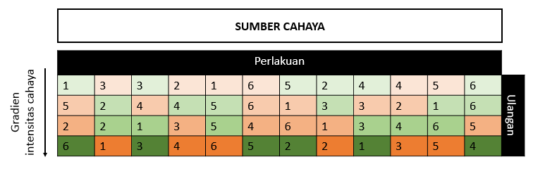

<style>
h1.title {
  text-align: center;
}
h4.author {
  text-align: center;
}
h4.date {
  text-align: center;
}

body {
text-align: justify}

</style>

```{r setup, include=FALSE}
knitr::opts_chunk$set(echo = TRUE)
```

<br>
<center>

</center>
<br>

Perkembangan *Internet of Things* dan teknologi telah merubah dunia. Data semakin mudah didapatkan dan menjadi fokus dari berbagai perusahaan besar di dunia. Pengambilan keputusan bisnis berdasarkan data menjadi semakin menjanjikan dan menjadi hal yang lumrah. Pembuatan mesin prediksi dan automisasi pekerjaan atau yang biasa dikenal dengan istilah *Machine Learning* dan *Artificial Intellegence* (AI) semakin merajalela, berikut bermunculannya profesi baru di bidang data sebagai Data Analyst, Data Scientist, dan lain-lain. Data bagaikan komoditas baru yang semakin gencar dicari dan menunggu untuk diolah, dibalut dalam satu topik besar yang kini jadi pembicaraan banyak orang yaitu *Data Science*.

Sayangnya, seiring dengan berkembangnya Data Science, tidak sedikit pula data scientist (orang-orang yang melakukan praktik data science/pengolahan data) yang terhambat di tengah jalan akibat data yang belum lengkap atau tidak mampu menjawab persoalan bisnis mereka. Muncul pertanyaan-pertanyaan seperti "Data apa saja yang perlu diambil? Berapa banyak data yang harus diambil?"

Pertanyaan-pertanyaan di atas dapat dijawab dengan memahami cara **perancangan dan pengoleksian data**. Melalui artikel ini, mari kita bahas mengenai kedua hal tersebut sehingga nantinya kita dapat merancang dan memperoleh data secara mandiri dan tidak terhambat dalam project Data Science. *Belajar merancang data, yuk!*

# Terminologi

Proyek Data Science bertujuan untuk mendapat suatu informasi tentang hal yang terjadi di lapangan berdasarkan data. Oleh karena itu, kita sering bertemu dengan istilah-istilah di bawah ini[^1] dalam merancang data:

* **Populasi**: keseluruhan individu yang ingin diamati

* **Sensus**: pengambilan data dari seluruh individu dalam populasi. 

Karena proses sensus terlalu lama dan membutuhkan biaya yang banyak, maka dilakukanlah suatu strategi:

* **Sampling**: pengambilan data dari sebagian populasi yang cukup representatif untuk mewakilkan populasi.

* **Sample**: sebagian dari populasi yang akan diamati

Sample inilah yang dimaksud dengan data dan banyaknya data yang akan digunakan dalam project data science.

<br>
<center>

</center>
<br>

# Rancangan Penelitian

Kumpulan sample yang dianalisis dalam proyek data science telah dirancang sedemikian rupa agar data-data dari sampel tersebut mampu menjawab business question yang sedang diusut. Kumpulan sample tersebut ditentukan dalam suatu rancangan penelitian atau yang biasa disebut **research design**. Rancangan penelitian penting untuk memastikan adanya keselarasan antara proses pengumpulan dan pengolahan data dengan pertanyaan bisnis yang kita ajukan[^2].

## Ragam Tipe

Dalam merancang penelitian, kita dapat menentukan terlebih dahulu pendekatan riset yang kita ambil. Berikut adalah 3 tipe pendekatan riset yang masing-masing merujuk pada tipe rancangan penelitian yang sesuai.

<br>
<center>

</center>
<br>

**1. Exploratory** 

Bertujuan untuk mengeksplorasi subjek/topik yang tidak kita ketahui sebelumnya. Hasil akhir studi ini dapat berupa *key issues* atau informasi yang bisa dijadikan dasar untuk studi lanjutan,  dimana data yang umumnya diambil bersifat kualitatif.

Tipe rancangan penelitian **Case Study** cocok untuk pendekatan ini. Case study merupakan studi yang terfokus pada subjek/kelompok tertentu dengan catatan data yang didapatkan tidak dapat digeneralisir untuk kelompok lainnya.

**2. Descriptive**

Bertujuan untuk mendeskripsikan subjek/topik yang sudah kita ketahui sebelumnya, namun kita ingin telusuri lebih jauh. Studi ini umumnya membutuhkan nilai akurasi dan presisi yang lebih tinggi sehingga data yang diambil umumnya bersifat kuantitatif. Beberapa rancangan penelitian yang cocok untuk pendekatan ini adalah:  

* **Survey**: bertujuan untuk mengoleksi sebanyak mungkin data yang terstandarisasi menggunakan instrumen yang juga terstandarisasi.

* **Comparative**: bertujuan untuk membandingkan dua atau lebih kondisi/grup. Contohnya untuk membandingkan performa murid yang berasal dari daerah A dan daerah B. 

**3. Explanatory**

Bertujuan untuk mengetahui sebab dan akibat dari hubungan antar variabel. Pendekatan ini disebut juga sebagai causal/prediktif. Tipe rancangan penelitian yang cocok untuk pendekatan ini adalah:

* **Experimental**: bertujuan untuk menganalisis perbedaan pada subjek penelitian pada kondisi eksperimental (dengan perlakuan tertentu) dan kondisi terkontrol (tanpa perlakuan). Perbedaan tersebut dapat digunakan untuk menyimpulkan hubungan sebab akibat yang diteliti.

* **Observational**: memiliki prinsip yang sama seperti eksperimental namun digunakan ketika kita tidak dapat memberi perlakuan tertentu pada subjek penelitian (umumnya karena berbenturan dengan kode etik atau kepraktisan penelitian). Researh design ini mengoleksi data dengan mengobservasi subjek yang tidak diberi treatment secara sengaja namun secara alamiah. Data yang diambil dapat berupa kualitatif dan kuantitatif. 

Pada artikel kali ini, kita akan membahas lebih dalam mengenai **Experimental Design** yang lebih umum dipakai untuk pengumpulan data yang terkontrol dengan berbagai variabel prediktor yang telah ditentukan. 

## Komponen

Setelah kita menentukan tipe rancangan penelitian yang sesuai, kita dapat merumuskan komponen-komponen penting dalam sebuah rancangan penelitian. Komponen-komponen tersebut adalah:

**1. Research Problem / Pertanyaan**

*Research problem* adalah pertanyaan bisnis atau pertanyaan riset yang ingin dijawab melalui eksperimen. Buatlah pertanyaan yang jelas mengenai target yang ingin diteliti dan faktor-faktor yang mempengaruhinya. 

Contohnya, "Apakah terdapat hubungan antara kegiatan berolahraga dengan tingkat obesitas seseorang?" Pada contoh tersebut, target yang ingin diteliti adalah tingkat obesitas dan faktor yang mempengaruhi adalah kegiatan berolahraga.

**2. Hipotesis** 

Hipotesis adalah prediksi jawaban awal untuk *research problem* yang kita ajukan. Hipotesis umumnya berdasarkan studi literatur atau pengetahuan yang sudah diketahui sebelumnya. Pada rancangan experimental, hipotesis akan diuji kebenarannya melalui eksperimen dan pengujian statistik. 

Suatu eksperimen akan memiliki 2 tipe hipotesis, hipotesis null (**H0**) dan hipotesis alternatif (**H1**). Pada umumnya, H0 adalah hipotesis yang mencetuskan bahwa tidak ada perbedaan antara grup kontrol dengan grup yang diberi perlakuan. Sementara H1 mencetuskan sebaliknya. Contohnya:

* `H0`: Tingkat obesitas orang yang berolahraga dengan yang tidak berolahraga tidak berbeda signifikan

* `H1`: Tingkat obesitas orang yang berolahraga dengan yang tidak berolahraga berbeda signifikan

**3. Metodologi Penelitian**

Metodologi penelitian mencakup deskripsi mengenai eksperimen/riset yang akan dilakukan. Secara umum metodologi terdiri dari:

* **Metode Sampling** yang menjelaskan data atau sample yang akan diambil, beserta jumlah dan cara pengumpulannya.

* **Analisis Statistik** yang menjelaskan cara analisis data hingga dapat ditentukan kebenaran dari hipotesis yang diuji. Beberapa uji statistik yang umum digunakan adalah *analysis of variance* (ANOVA) dan T-test.

Setelah kita menentukan pertanyaan dan hipotesis penelitian. Kita dapat mulai menyusun metodologi penelitian berdasarkan tipe rancangan penelitian yang digunakan. Pada artikel ini, kita akan menggunakan *Experimental Design*.

# Experimental Design

Eksperimental design dimasukkan ke dalam satu topik tersendiri dalam artikel ini karena memiliki porsi yang cukup besar dalam perancangan penelitian. Eksperimental design akan menerjemahkan research question dan hipotesis yang telah dirumuskan menjadi titik-titik sampling yang dapat menjelaskan kejadian sebenarnya.

## Komponen

Dalam membuat experimental design, kita perlu menentukan komponen-komponen di bawah ini: 

1. **Variable Prediktor**

Variabel ini disebut juga sebagai input, *independent variable*, atau `x`. Variabel-variable inilah mempengaruhi nilai dari variabel target/output kita. Jumlah variabel prediktor dapat berupa **satu faktor** atau **multifaktor** (lebih dari 1 faktor) dalam satu periode eksperimen. Pendekatan multifaktor membolehkan adanya interaksi antar beberapa variabel prediktor. Satu faktor dapat terdiri dari hanya 1 level (contohnya berolahraga/tidak berolahraga) atau multilevel (contohnya berolahraga dengan durasi tertentu).

2. **Variabel Target**

Variabel ini disebut juga sebagai output, respon, *dependent variable*, atau `y`. Nilai dari variabel ini dipengaruhi oleh variabel prediktor.

3. **Variabel Kontrol**

Faktor luar selain variabel prediktor yang dijaga konstan sehingga tidak memberikan variansi pada hasil eksperimen dan mengganggu analisis hasil eksperimen.

4. **Titik Sampling**

Titik sampling adalah sample yang ingin kita ambil dari suatu populasi. Titik sampling ini dipilih menggunakan prinsip-prinsip tertentu, yaitu:

**Randomisasi**

Randomisasi adalah penentuan sampel secara random sehingga studi dilakukan secara objektif. Hal ini memastikan masing-masing komponen dalam populasi mempunyai kesempatan yang sama untuk dijadikan sample penelitian.

**Replikasi/Pengulangan**

Replikasi adalah pengulangan pengambilan data untuk mencegah adanya nilai yang terambil secara kebetulan. Hal ini berguna untuk menghasilkan estimasi nilai yang lebih akurat (tepat) dan reliable (konstan) dari hasil eksperimen. Terdapat dua jenis replikasi dalam eksperimental design:

* *Technical replicates* yaitu pengulangan pengambilan data dari sumber atau sample yang sama. Hal ini untuk mencegah kesalahan pengukuran. Umumnya dilakukan bila akurasi alat ukur tidak terlalu tinggi. Technical replicates umumnya dilakukan sebanyak 3 kali.

* *Biological replicates* yaitu pengambilan data dari sumber atau sample yang berbeda. Pada biological replicates kita diminta untuk setidaknya memiliki 3-4 sample untuk merepresentasikan nilai target dengan perlakuan tertentu. 

**Blocking**

Blocking adalah penyusunan sample kedalam beberapa kelompok yang memiliki kemiripan tertentu. Contohnya adalah pengelompokan sample kedalam block gender yang berbeda, lokasi yang berbeda, dan lain-lain. Blocking berguna untuk mereduksi variansi dari faktor luar yang telah diketahui dan bisa dihindari. Setelah dilakukan blocking, titik sampling dapat diambil secara random dengan jumlah replikasi yang diinginkan untuk tiap kelompok blocking.

Setelah kita menentukan variabel prediktor, variabel target, variabel konstan, dan prinsip-prinsip titik sampling yang dijelaskan di atas, kita dapat menentukan **jumlah sample** yang dibutuhkan. 

Pada kasus ini, kita tidak menggunakan teknik sampling tertentu (mengambil sebagian dari populasi), namun justru membuat sample berdasarkan kriteria yang kita butuhkan. Meskipun begitu, terdapat beragam teknik sampling yang dapat digunakan untuk penelitian. Seema Singh (2018) dalam artikelnya yang berjudul [Sampling Techniques](https://towardsdatascience.com/sampling-techniques-a4e34111d808) telah menjelaskan beragam teknik sampling tersebut secara ringkas dan jelas. 

## Ukuran Sample

Kegiatan menentukan jumlah observasi & replikasi untuk suatu eksperimen disebut juga **penentuan ukuran sample**. Ukuran sample umumnya ditentukan berdasarkan biaya, waktu dan kemudahan dalam mendapatkan sampel tersebut. Penentuan ukuran sample juga mempertimbangkan statistical power yang kita butuhkan. Statistical power atau *the power of binary hypothesis test* adalah probabilitas suatu tes untuk menolak hipotesis awal (H0) saat tersedia hipotesis alternatif (H1).

Terdapat beberapa panduan yang memudahkan kita untuk merancang blocking dan menentukan ukuran sample[^3]:

1. Eksperimen faktor tunggal dengan 1 level maka akan memiliki tipe perlakuan sebanyak:

2 tipe perlakuan yaitu `**kontrol dan perlakuan**`. 

2. Eksperimen faktor tunggal dengan multilevel maka akan memiliki tipe perlakuan sebanyak:

`**jumlah level + 1 kontrol**`.

3. Eksperimen multifaktor dengan multilevel akan memiliki tipe perlakuan sebanyak:

`**(jumlah level faktor 1 + 1 kontrol) * (jumlah level faktor 2 + 1 kontrol) * ... dst.**`

4. Bila dilakukan blocking, maka setiap block seharusnya memiliki jumlah sample yang sama yang mewakili tiap treatment yang ada. Randomisasi perlakuan kemudian dapat dilakukan untuk tiap block.

5. Masing-masing perlakuan sebaiknya diwakilkan oleh 3-4 sample yang berbeda (*biological replicates*). 

6. Pengukuran untuk masing-masing sample boleh diulang (contohnya 3x) sebagai *technical replicates*. 

7. Secara umum, jumlah sampel yang lebih banyak lebih baik karena dapat menghasilkan tingkat presisi yang lebih tinggi.

Selain beberapa pegangan di atas, ukuran sampel dapat diperkirakan menggunakan Mead's Resource Equation. **Mead's Resource Equation** terutama digunakan untuk mengestimasi jumlah sampel yang dibutuhkan bila nilai standar deviasi (ekspektasi perbedaan nilai antara kelompok kontrol dan perlakuan) tidak diketahui/sulit diestimasi. Berikut adalah rumusnya:

<center>
$E = N - B - T$
</center>

Keterangan:

* `N` = jumlah sample dalam eksperimen - 1
* `B` = jumlah komponen blocking - 1
* `T` = jumlah perlakuan (termasuk kontrol) - 1
* `E` = *degrees of freedom* dari error (nilai yang diharapkan antara 10 - 20)

Berikut adalah contoh perhitungannya:

Anda ingin melakukan riset mengenai pengaruh kegiatan berolahraga terhadap berat badan manusia. Terdapat 1 faktor perlakuan yaitu kegiatan berolahraga lari dengan 3 level intensitas (1x/minggu, 3x/minggu, 5x/minggu). Terdapat 2 responden yang diobservasi untuk tiap perlakuan. Tidak ada komponen blocking/stratifikasi karena semua responden berjenis kelamin pria dan memiliki karakteristik yang serupa. 

Bila dijumlahkan:

* `N` = (4*2)-1 = 7
* `B` = 0-1 = -1
* `T` = 4-1 = 3
* `E` = 5

E < 10 (kurang dari ambang yang diharapkan) sehingga diperkirakan bahwa jumlah sampel Anda terlalu sedikit untuk tiap perlakuan. 5 responden untuk tiap perlakuan (N=19) mungkin akan lebih baik untuk eksperimen ini.

Selain menggunakan Mead's Resource Equation, kita juga dapat menggunakan pendekatan berdasarkan jumlah populasi, *confidence interval*, *confidence level*, atau standar deviasi yang sudah ditentukan[^4]. Pada praktiknya, beberapa perusahaan juga telah memiliki standar tertentu dalam menentukan ukuran sampel dan data-data yang baik untuk disampling berdasarkan pertimbangan yang matang.

# Dive Deeper: Chilli Red!

Setelah mengeksplorasi macam-macam prinsip dan cara merancang data, mari kita praktikan ilmu baru kita dalam merancang data. Bayangkan Anda adalah seorang *researcher* yang ingin menawarkan suatu produk inovasi terbaru berupa pupuk prebiotik yang diklaim mampu meningkatkan pertumbuhan tanaman cabai di media tanam tanah gembur maupun tanah liat berhumus. Untuk itu, Anda ingin menganalisis pengaruh penggunaan pupuk prebiotik terhadap pertumbuhan tanaman cabai. Research design seperti apa yang akan anda rancang?

<br>
<center>

</center>
<br>

Untuk mempermudah, kita dapat mengisi pertanyaan-pertanyaan berikut:

1. Pendekatan riset apa yang ingin dipakai? **Explanatory**, karena saya ingin menjelaskan hubungan sebab akibat antara penggunaan pupuk prebiotik dengan pertumbuhan tanaman cabai.

2. Tipe rancangan penelitian apa yang akan digunakan? **Experimental Design**, karena subjek penelitian dapat diberikan perlakuan tertentu dan dilakukan pengontrolan.

3. **Komponen Rancangan Penelitian**:

* **Research problem**: Apakah pemberian pupuk prebiotik meningkatkan pertumbuhan tanaman cabai? 

* **Hipotesis**: 

    `H0`: Pemberian pupuk A tidak meningkatkan pertumbuhan tanaman cabai.
    
    `H1`: Pemberian pupuk A meningkatkan pertumbuhan tanaman cabai.

* **Metodologi Penelitian**: dijelaskan pada bagian experimental design.

4. **Experimental Design**:

**Variabel Prediktor**: Terdapat 2 variabel prediktor. Variabel pertama yaitu pemberian pupuk prebiotik dengan 5 level (1 g/L, 10 g/L, 15 g/L, 30 g/L, 60 g/L) dan kontrol (tanpa pupuk). Variabel kedua adalah jenis media tanam berupa tanah gembur atau tanah liat berhumus.

**Variabel Target**: panjang tanaman cabai.

**Variable Kontrol**: jenis benih cabai, temperatur, sumber cahaya, laju pengairan, dan variabel pertumbuhan lainnya dijaga agar seragam. Digunakan komponen blocking tambahan berdasarkan lokasi tanam yang dekat/jauh dari sumber cahaya.

**Titik dan ukuran sample**:

Jumlah perlakuan total adalah 12 (`(5+1)*2 = 12`). Tiap perlakuan akan memiliki 4 sample atau ulangan (biological replicates). Total sample adalah 48 (`4*12 = 48`). Berikut adalah desain blocking untuk experimental design yang akan dilakukan. Randomisasi perlakuan diterapkan untuk tiap block.

Berikut adalah blocking sebelum dilakukan randomisasi:

<br>
<center>

</center>
<br>

Berikut adalah blocking setelah dilakukan randomisasi:

<br>
<center>

</center>
<br>

Demikianlah contoh pembuatan rancangan penelitian untuk mengumpulkan data yang kita butuhkan. Semoga artikel ini bermanfaat dalam memulai project-project data science Anda selanjutnya!

[^1]: [University of Missoury - St.Louis. *Population and Sampling*. Accessed 12 February 2020](https://www.umsl.edu/~lindquists/sample.html)
[^2]: Kirshenblatt-Gimblett, B. 2006. *Part 1, What Is Research Design? The Context of Design*. Performance Studies Methods Course Syllabus. New York: New York University
[^3]: Center for Research Informatics Bioinformatics Core, The University of Chicago Medicine & Biological Science. 2015. *Bioinformatics Advice on Experimental Design*
[^4]: [Qualtrics. 2020. *Determining Sample Size: How to Ensure You Get the Correct Sample*. Accessed 12 February 2020](https://www.qualtrics.com/experience-management/research/determine-sample-size)